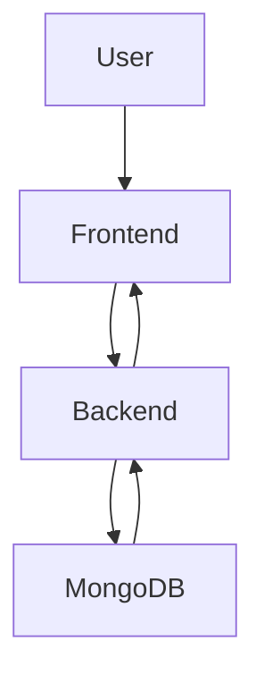
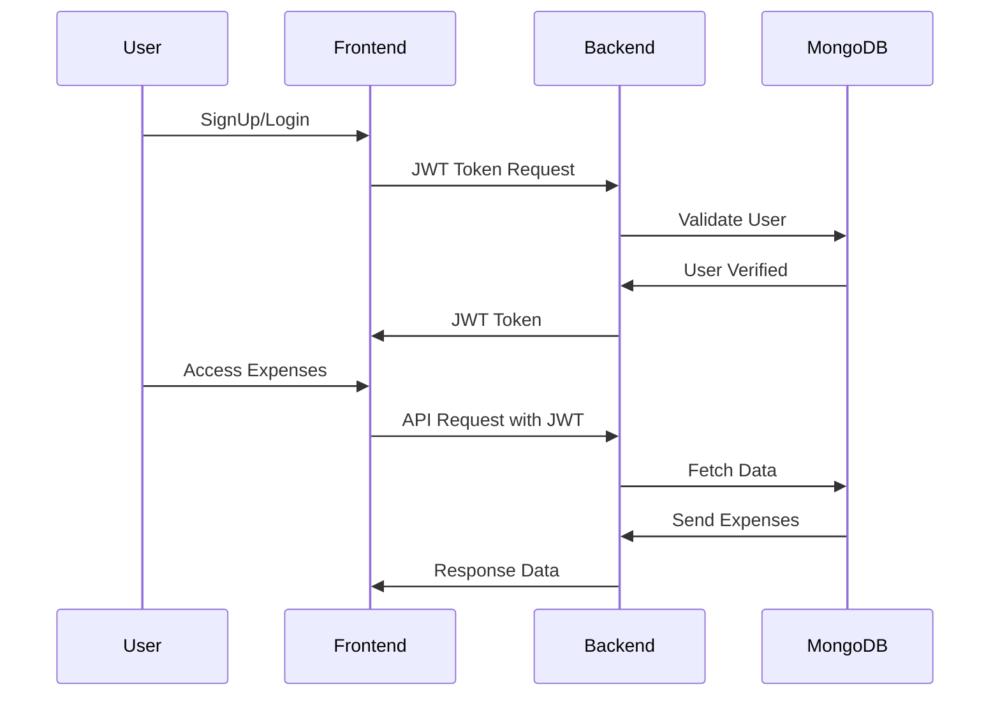

### 📄 **Xpenso - Expense Tracker App**
Xpenso is a simple yet powerful **Expense Tracker** built with the **MERN stack** (MongoDB, Express.js, React.js with Vite, Node.js) that helps users **track daily expenses** with features like **User Authentication**, **Filtering**, **Pagination**, **Dark Mode**, and **Total Expense Calculation**.

---

## 🔗 Live Demo
👉 [Xpenso Live](https://xpenso-weld.vercel.app)

---

## 📌 Features
✅ JWT Authentication  
✅ Add Expense with Amount, Description, Category & Date  
✅ Filter Expenses by Category & Date  
✅ Search Expenses by Description  
✅ Total Expense Calculation  
✅ Pagination  
✅ Dark Mode  
✅ Skeleton Loaders  
✅ Toast Notifications  
✅ Form Validations  
✅ Responsive UI  

---

## ⚙️ Tech Stack
| Technology     | Purpose                |
|---------------|-----------------------|
| React.js      | Frontend Framework    |
| Vite          | Fast Build Tool       |
| TailwindCSS   | Styling              |
| Node.js       | Backend Server       |
| Express.js    | API Development      |
| MongoDB       | Database             |
| Axios         | API Calls           |
| JWT           | Authentication       |
| React Hook Form | Form Validation    |
| react-hot-toast | Notifications       |

---

## 📄 Folder Structure
```
Xpenso/
├─ backend/               # Backend folder
│  ├─ config/             # Mongoose connection
│  ├─ models/             # Mongoose models
│  ├─ routes/             # API routes
│  ├─ controllers/        # API logic
│  ├─ middleware/         # JWT Authentication and Authorization
│  └─ index.js           # Express App Entry Point
├─ frontend/                # Frontend folder
│  ├─ src/
│  │  ├─ components/      # Reusable Components
│  │  ├─ context/         # Context API
│  │  ├─ pages/           # React Pages
│  │  ├─ services/        # API Calls
│  │  └─ App.jsx          # Main App Component
│  └─ vite.config.js      # Vite Configuration
└─ README.md              # Documentation
```

---

## 🔑 Environment Variables
Create a **.env** file in both backend and frontend folders.

### Backend
```
MONGO_URI=your_mongodb_uri
JWT_SECRET=your_jwt_secret
PORT=5000
NODE_ENV=development
```

### Frontend
```
VITE_BASE_URL=http://localhost:5000/api
```

---

## 🚀 Installation & Setup

### Clone Repository
```bash
git clone https://github.com/hemantsoni23/xpenso.git
cd xpenso
```

### Install Backend Dependencies
```bash
cd backend
npm install
node index.js
```

### Install Frontend Dependencies
```bash
cd client
npm install
npm run dev
```

---

## 🌐 API Endpoints

| Method | Endpoint           | Description             | Authentication |
|-------|----------------|-----------------------|---------------|
| POST   | /api/auth/register | Register User        | ❌           |
| POST   | /api/auth/login    | Login User          | ❌           |
| POST   | /api/expenses      | Add Expense        | ✅           |
| GET    | /api/expenses      | Get Expenses & Filter       | ✅           |
| GET    | /api/expenses/total | Get Total Expense   | ✅           |

---

## 🔑 Future Improvements
- Infinite Scroll for Expense Listing  
- Export Expenses to CSV  
- Secure **httpOnly cookies** instead of storing JWT in localStorage  
- Google OAuth Authentication  
- Monthly Expense Summary Charts using ChartJS

---

## 🧠 System Design Diagram
### Expense Flow


---

## 🔗 Deployed Links
- Frontend: [Vercel](https://xpenso-weld.vercel.app)
- Backend: [Render](https://xpenso-backend.vercel.app)

---

## 🔒 Authentication Flow

---

## 🔑 How to Create New Expenses ?
The **Post Expense API** use to create new expenses:
```js
POST /api/expenses
Authorization: Bearer <JWT Token>
Body=expenseData
```
---
---

## 🔑 How to Get All Expenses of an user?
The **Get Expense API** aggregates expenses for a User:
```js
GET /api/expenses
Authorization: Bearer <JWT Token>
```
---
---

## 🔑 How to Filter Expenses based on category and date?
The **Get Expense API** aggregates expenses for the selected date:
```js
GET /api/expenses?category='Education'&date=2025-03-05
Authorization: Bearer <JWT Token>
```
---

## 🔑 How to Calculate Total Expenses?
The **Total Expense API** aggregates expenses for the selected date:
```js
GET /api/expenses/total?start=2025-02-05&end=2025-03-05
Authorization: Bearer <JWT Token>
```
---

## 🛠️ Tools Used
- Vercel (Frontend Deployment)  
- Render (Backend Deployment)  
- MongoDB Atlas  
- JWT Authentication  
- React Hook Form  

---

## 🎯 How to Run Locally?
```bash
# Backend
cd backend
npm install
node index.js

# Frontend
cd client
npm install
npm run dev
```
---

## 🔥 Author
**Hemant Soni**  
💻 Passionate Full Stack Developer  

---

## 📌 Contact Me
- LinkedIn: [Hemant Soni]([https://linkedin.com/in/hemant-soni](https://www.linkedin.com/in/hemant-soni-052199205/))
- GitHub: [hemant-soni](https://github.com/hemantsoni23)
- Email: sonih5190@gmail.com  

---

## 🌟 If you like this project, give it a ⭐ on [GitHub](https://github.com/hemantsoni23/xpenso) 😍

---

### Made with ❤️ by Hemant Soni 🚀
